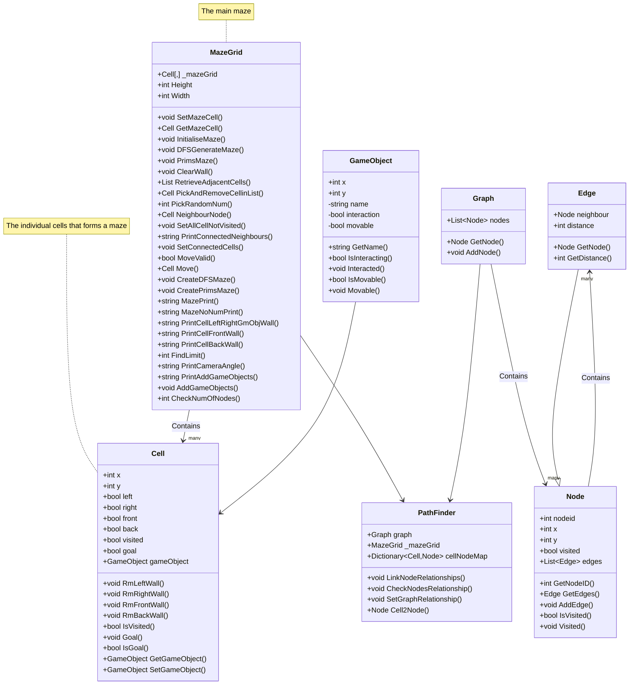

# Documentation for MazeGame
Table of Contents
- [Class Diagrams](#class-diagram-overview)
- [MazeGrid](#mazegrid)
- [Cell](#cell)
- [Graph](#graph)
- [Node](#node)
- [GameObject](#gameobject)
- [PathFinder](#pathfinder)
## Class Diagram Overview

----
## MazeGrid
### Properties
#### Height, Width
Integers that gives the size of the maze/2D array of cells
#### \_mazeGrid
Two-dimensional array of cells
### Initialiser
How to create a Class MazeGrid
```
MazeGrid m = new MazeGrid(integer,integer)
First integer = x-axis or width
Second integer = y-axis or height

PROCEDURE new MazeGrid(int w,int h,GameObject[] gameObjects = null)
	Cell[,] _mazeGrid = new Cell[w,h]
	FOR int i = 0;i < width-1;i++ 
		FOR int j = 0;j < height-1;j++ 
			_mazeGrid[i,j] = new Cell(i,j,false)
		ENDFOR
	ENDFOR
ENDPROCEDURE
```
### Methods
#### DFSGenerateMaze
**Parameters**: Cell, Cell

DFS stands for depth-first search
>This algorithm performs a depth-first search while breaking the walls between cells during traversal.

```
PROCEDURE DFSGenerateMaze(Cell prevCell,Cell currCell)
	//marks the currCell as visited
	currCell.Visited()
	// checks the x,y coords to decide which two walls to break between cells
	ClearWall(prevCell,currCell)
	DO
		//nextCell is a random cell from currCell.neighbours
		nextCell = Take a random cell from currCell.neighbourCells
		IF nextCell NOT null AND nextCell NOT Visited THEN
			Maze_DFS(currCell,nextCell)
		ENDIF
	 WHILE nextCell NOT null
ENDPROCEDURE
```
**Proof of concept**\
[RandomMaze1](https://github.com/Jackpang-kings/Maze2.0/blob/firstDraft/Assests/RandomMaze1.png)\
[RandomMaze2](https://github.com/Jackpang-kings/Maze2.0/blob/firstDraft/Assests/RandomMaze2.png)\
[RandomMaze3](https://github.com/Jackpang-kings/Maze2.0/blob/firstDraft/Assests/RandomMaze3.png)

These are some of the mazes generated by the algorithm and since it uses the idea of depth-first traversal, it is more likely to be one route domiant(long path without another path to choose), as the traversal only goes back if it cannot traverse in any direction anymore.
#### PrimsMaze
Using Prim's algorithm to generate maze

The cell is where the generate starts at.
**Parameter**: Cell startCell

```
PROCEDURE PrimsMaze(Cell startCell)
	// Make a list of cell that shuffles
	List<Cell> ShuffleList = new List<Cell>
	FOREACH cell c in startCell.neighbourCells
		ShuffleList.Add(c)
	ENDFOREACH
	ShuffleList = FYShuffleList(ShuffleList)
	Cell nextCell = ShuffleList[0]
	ClearWall(startCell,nextCell)
	WHILE ShuffleList is not empty
		Cell currentCell = nextCell
		currentCell.Visited()
		List<Cells> neighbours = RetrieveAdjacentNodes(currentCell.neighbourCells)
		FOREACH cell c in neighbours
			ShuffleList.Add(c)
		ENDFOREACH
		ShuffleList = FYShuffleList(ShuffleList)
		nextCell = ShuffleList[0]
		ClearWall(currCell,nextCell)
	ENDWHILE
```

#### ClearWall
**Purpose**: Clear the Wall in between two Cells
**Parameter**: Cell previousCell, Cell currentCell
```
PROCEDURE ClearWall(Cell prevWall, Cell currWall)
	IF prevCell NOT null THEN
		IF currCell is left of prevCell
			prevCell.RmLeftWall()
			currCell.RmRightWall()
		ELSE IF currCell is right of prevCell
			prevCell.RmRightWall()
			currCell.RmLeftWall()
		ELSE IF currCell is under prevCell
			prevCell.RmBackWall()
			currCell.RmFrontWall()
		ELSE IF currCell is on top of currCell
			prevCell.RmFrontWall()
			currCell.RmBackWall()
		ENDIF
	ENDIF
ENDPROCEDURE
```

>Compare the previousCell, currentCell (x,y) coordinates and clear the wall in between them

#### RetrieveAdjacentCells
**Parameter**: List of Cells from edges\
>return **all cells that are not visited**
### NeighbourNode
**Parameter**: Cell
>Get List of Cells from **RetrieveAdjacentNodes**
>Get the first **Cell** from **RetrieveAdjacentNodes**
>return **Cell**

#### PrintCameraAngle
**Parameters**: GameObject obj, int radius\
**Return**: string message
```
Use obj to find Cell position
int x = Cell.x
int y = Cell.y
int xUpper = FindLimit(x,true,radius,true)
int yUpper = FindLimit(y,true,radius,false)
int xLower = FindLimit(x,false,radius,true)
int yLower = FindLimit(y,false,radius,false)

int xSize = Math.ABS(xUpper-xLower)
int ySize = Math.ABS(yUpper-yLower)
MazeGrid cameraAngle = new MazeGrid(xSize,ySize)
int a = 0
int b = 0
FOR int i = xLower, i < xSize, i++ 
	FOR int j = yLower, j < ySize, j++
		cameraAngle._mazeGrid[a,b] = this._mazeGrid[i,j]
		a++
		b++
	ENDFOR
ENDFOR

string mazeprintmessage =""
mazeprintmessage += PrintCellFrontWall(GetMazeRows(0))
FOR int k = 0, k < ySize, k++
	Cell[] rowOfCells = cameraAngle.GetMazeRow(k)
	mazeprintmessage += cameraAngle.PrintCellLeftRightGmObjWall(rowOfCells)
	mazeprintmessage += cameraAngle.PrintCellBackWall(rowOfCells)
ENDFOR
return mazeprintmessage
	
```

#### FindLimit
**Parameters**: int a, bool sign, int radius, bool direction\
**bool Sign**: true = add, false = subtract\
**bool direction** true = horizontal, false = vertical
```
FUNCTION INT FindLimit(int a, bool sign, int radius, bool direction)
	int limit
	int count
	// Determines if dealing with x or y
	IF direction == true
		// x
		limit = width
	ELSE
		// y
		limit = height
	ENDIF

	// Check if adding or subtracting 
	IF sign == TRUE
		// Adding
		WHILE (a<limitANDcount<=radius)
			a++
			count++
		ENDWHILE
	ELSE
		// subtracting
		WHILE (a>=0&&count<=radius)
			a--
			count++
		ENDWHILE
	ENDIF
	// Return limit
	RETURN a
ENDFUNCTION
```

#### Move()
**Purpose**: Change the x,y of the gameobject\
**Parameters**: Cell currentCell, string direction
```
PUBLIC PROCEDURE Move(Cell currentCell, string direction)
	int x = currentCell.x
	int y = currentCell.y
	GameObject object2Move = currentCell.GetGameObject()
	Cell nextCell
	IF direction == "UP"
		nextCell = _mazeGrid[x,y-1]
		object.y--
		Swap()
	ELSE IF direction == "DOWN"
		nextCell = _mazeGrid[x,y+1]
		object.y++
		Swap()
	ELSE IF direction == "LEFT"
		nextCell = _mazeGrid[x-1,y]
		object.x--
		Swap()
	ELSE IF direction == "RIGHT"
		nextCell = _mazeGrid[x+1,y]
		object.x++
		Swap()
	ENDIF
	PROCEDURE Swap()
		GameObject holder = nextCell.GetGameObject()
		nextCell.SetGameObject(object2Move)
		currentCell.SetGameObject(holder)
	ENDPROCEDURE
ENDPROCEDURE
```

#### MoveValid()
**Purpose**: Check if the move is valid\
**Parameters**: Cell c, string direction\
**Returns**: bool valid
```
PUBLIC FUNCTION BOOL MoveValid(Cell c, string direction)
	int x = object.x
	int y = object.y
	bool valid = false
	IF direction == "UP"
		// If the cell above c is not out of bounds and c does not have a wall on top
		IF y-1 >= 0 AND NOT c.FrontWall
			valid = true
		ENDIF
	ELSE IF direction == "DOWN"
		// If the cell above c is not out of bounds and c does not have a wall on bottom
		IF y+1 < gameboard.Height AND NOT c.BackWall
			valid = true
		ENDIF
	ELSE IF direction == "LEFT"
	// If the cell above c is not out of bounds and c does not have a wall on left
		IF x-1 >= 0 AND NOT c.LeftWall
			valid = true
		ENDIF
	ELSE IF direction == "RIGHT"
	// If the cell above c is not out of bounds and c does not have a wall on right
		IF x+1 < gameboard.Width AND NOT c.RightWall
			valid = true
		ENDIF
	ENDIF
	RETURN valid
ENDFUNCTION
```


----
## Cell
### Properties
#### Coordinates (x,y)
The coordinates are integers that represent the cell's location in the MazeGrid, It could also be used to calculate distance and where the current position of the cell is.

#### Walls 
Wall is a Boolean represent the barrier in between cells so the path to a certain position is restricted to a specific route. They also help visualise how the maze looks like.

The barrier restricts how the player and mobs would like to do to a certain direction, that direction of the wall would have to be opened.

#### Visited
Visited is a Boolean that is used for general maze traversal, traversal are used to create maze, looking for neighbour cells, connected cells and solving the maze.

#### NeighbourCells
NeighbourCells is a List of Cells that stores all cells that is one cell next itself.
This list of cells could allow
- Saves time complexity of checking the cell's neighbour whenever the maze has to be regenerated, so time complexity is only O(n)

#### ConnectedCells
ConnectedCells is a List of Cells that stores the cells that it is open to, which means it has no walls between that cell.

#### Difference between NeighbourCells and ConnectedCells
```
This is a cell A
#---#
|   |
#---#

This is cell A connected to cell B, cell B is a connectedCell to cell A, vice versa
  A    B
#---##---#
|        |
#---##---#

Cell c is cell A's neighbour but not connectedCell to cell A
  C    A
#---##---#
|   ||   |
#---##---#
```
#### Goal
Goal is a Boolean that marks a specific cell that it is the "End" goal.

### Initialiser
How to create a Class Cell
```
Cell c = new cell(<integer>,<integer>,<boolean>,<GameObject>)
First integer = this.x
Second integer = this.y
Boolean = this.go
GameObject = this.object

PROCEDURE new Cell(int a,int b,bool go,GameObject g)
	this.x = a
	this.y = b
	this.goal = go
	this.object = g
ENDPROCEDURE
```
### Methods
#### RmLeftWall()
>set **leftWall** = false
#### RmRightWall()
>set **rightWall** = false
#### RmFrontWall()
>set **frontWall** = false
#### RmbackWall()
>set **backWall** = false
#### Visited(bool v)
>set **visited** = v
#### IsVisited()
>return **visited**
#### Goal(bool g)
>set **goal** = g
#### IsGoal()
>return **goal**
#### AddConnectedCells(Cell cell)
>**Add** cell into this.**connectedCells**
#### GetConnectedCells()
>**RETURN** list of cells from this.**connectedCells**

#### GetGameObject()
>**RETURN** gameObject

#### SetGameObject()
>**SET** gameObject

----
## Graph
### Properties
#### nodes
List of class Node
This is used to store all nodes
### Intialiser
```
PROCEDURE Graph(List<Node> n)
	nodes = n
```
### Methods
#### AddNode()
**Parameter**: Node n\
> Add n in this.**nodes**
#### GetNode()
**Parameter**: int id\
>**RETURN** Node from this.**nodes**

#### Breadth-first traversal
Use breadth-first traversal to traverse the maze and connect all nodes relationship

Pseudo-code of BFT
```
BFT(Node startNode):
    1. Create an empty queue Q
    2. Create an empty set VISITED to track visited nodes
    3. Enqueue the start node s into Q
    4. Add s to VISITED
    5. While Q is not empty:
        a. Dequeue the front node u from Q
        b. Process node u (e.g., print it or add it to a result list)
        c. For each neighbor v of u in G:
			 i. If v is not in VISITED:
			                - Enqueue v into Q
			                - Add v to VISITED
    6. End
```

Using my objects and methods
In the phase of checking the nodes' relationship between each other
```
PROCEDURE List<Cell> BFT(Node startNode,Node )
	Queue<Cell> q = new Queue<Cell>
	q.enQueue(s)
	List<Cell> traverseRoute = new List<Cell>
	BOOL found = false
	WHILE !q.empty() AND !found THEN
		// take the cell
		Cell u = q.deQueue()
		u.Visited(TRUE)
		traverseRoute.Add(u)
		// Checks if u is cellToFind
		IF u = cellToFind THEN
			found = true
		ENDIF
		// Connect t
		FOREACH Cell v in u.connectedCells
			u.EnQueue()
		ENDFOREACH
	ENDWHILE
	RETURN List<Cell>
ENDPROCEDURE
```

#### DijkstraTraversal
**Parameter**: startNode, endNode
- dist, an array of distances from the source node ss to each node in the graph, initialized the following way: _dist_(s) = 0; and for all other nodes v, _dist_(v) = ∞. This is done at the beginning because as the algorithm proceeds, the _dist_ from the source to each node vv in the graph will be recalculated and finalized when the shortest distance to vv is found
- Q, a queue of all nodes in the graph. At the end of the algorithm's progress, Q will be empty.
- S, an empty set, to indicate which nodes the algorithm has visited. At the end of the algorithm's run, SS will contain all the nodes of the graph.

**Pseudocode**
1. We find the unvisited node with the shortest distance to our starting node
2. We take that node $n$ and take all the connected nodes that are not visited.
3. For each node in $n$.connectedNodes compute how far $d$ the starting node if we go through the $n$ (the distance from the $n$ to the starting node to its neighbour)
4. If the $d$ is shorter than what we have in the set, we update the distance.
5. We mark current island as visited, knowing that we now have the shortest path to the that node
6. This procedure is repeated for the next closest unvisited node
**Returns**: List of Node that is the shortest path from the startNode to endNode

```
FUNCTION List<Node> Dijkstra(Node startNode, Node endNode)
	// Declare distance array
	dist[] = new INT[graph.size]
	
	// Set every node distance of infinity
	FOREACH INT i in dist
		i = int.MAXVALUE
	ENDFOREACH

	// Declare PriorityQueue
	DistanceQueue q = new DistanceQueue()
	
	// Empty set of List of nodes
	List<Node> solution = new List<Node>()

	// Start with the startNode
	int distFromStartNode = 0
	dist[startNode.ID] = 0
	q.Enqueue(startNode)
	
	WHILE (!q.IsEmpty() )
		// Take the minimum distance route
		Node currentNode = q.Dequeue()

		// Take connections
		List<Edge> edges = BubbleSortEdge(currentNode.GetEdges())
		FOREACH Edge e IN edges
			// Compute distance from currentNode to e.Node
			int distTemp = distFromStartNode + e.distance
			Node n = e.GetNode()
			int id = n.ID
			
			// 
			IF NOT n.IsVisited() & n NOT in q THEN
				q.Enqueue(n,distTemp)
			ENDIF
			// Check the new calculated distance to update Queue and dist[]
			IF distTemp < dist[id] THEN
				dist[id] = distTemp
				q.Update(n,distTemp)
			ENDIF
		ENDFOREACH
		// Visit node
			currentNode.Visited(true)

		// Update distance from start node if found faster path
		IF dist[currentNode.ID] < distFromStartNode THEN
			distFromStartNode = dist[currentNode.ID]
		ENDIF
		
	ENDWHILE
	RETURN solution
	
```
----
## Node
### Properties
#### NodeID
Used to call Node
#### Coordinates (x,y)
The coordinates are integers that represent the cell's location in the MazeGrid, It could also be used to calculate distance and where the current position of the cell is.
#### Visited
Visited is a Boolean that is used for general maze traversal, traversal are used to create maze, looking for neighbour cells, connected cells and solving the maze.

#### Edges
The edges is used to store the relationship between nodes and distance between them
### Initialiser
```
PROCEDURE Node(INT id,INT a, INT b,List<Edge> Edges)
	this.x = a
	this.y = b
	this.nodeID = id
ENDPROCEDURE
```
### Methods
#### GetNodeID()
>**RETURN** int
#### IsVisited()
>**RETURN** visited
#### Visited()
**Parameter**: boolean
>**SET** visited as boolean
#### GetEdges()
>**RETURN** edges
#### AddEdge()
>**ADD** edge in edges

----
## Edge
### Initialise
```
PUBLIC PROCEDURE Edge(Node n,int d)
	neighbour = n
	distance = d
ENDPROCEDURE
```

### Methods
#### GetNode()
**Returns**: node
#### GetDistance()
**Returns**: distance

----
## GameObject
### Introduce
A GameObject is anything that could be in a cell. For example, a Player, an Item, a mob, etc.
### Properties
#### Coordinates (x,y)
Integer are used to identify where the GameObject is in oder to do navigation, interaction and drawing where it is.
#### Name
A string to identify an GameObject
#### Interaction
Boolean to represent if it is interacting with other GameObject
#### Movable
Boolean to represent if the item is movable
### Initialise
```
# a is x-coordinates
# b is y-coordinates
PUBLIC CREATE GameObject(string n, int a, int b, bool in, bool mova)
	name = n
	x = a
	y = b
	interaction = in
	movable = mova
END
```

### Methods
#### GetName()
>RETURN name
#### IsInteracting()
>RETURN interaction
#### Interacted()
**Parameter**: bool value
>SET interaction = value
#### IsMovable()
>RETURN movable
#### Movable()
**Parameter**: bool value
>SET movable = value

----
## PathFinder
### Properties
#### Graph
Graph that relates to the maze
#### MazeGrid
Maze that is turning into graph
#### cellNodeMap
Dictionary that requires a key of a cell and gives a value of a node

### Initialiser
Add every cell that is a node into the graph
```
PUBLIC PathFinder(MazeGrid m, graph g)
	_maze = m
	graph = g
	cellNodeMap = new Dictionary<Cell,Node>()
	INT nodecounter = 0
	// Looping for the entire maze
	FOR (INT i = 0,i<_maze.Width(),i++)
		FOR (INT j = 0,j<_maze.Height(),j++)
			// For each cell in Cell[,]
			Cell c = _maze._mazeGrid[i,j]
			IF (c.IsNode(_maze.Width(),_maze.Height()))
				Node newNode = new Node(nodecounter, c.x, c.y, new List<Edge>)
				nodecounter++
				graph.Add(newNode)
				cellNodeMap[c] = newNode
			ENDIF
		ENDFOR
	ENDFOR
END
```
### Methods
#### LinkNodeRelationships()
Connect every node together
```
PUBLIC PROCEDURE LinkNodeRelationships()
	FOREACH Cell c in _maze._mazeGrid
		IF c.IsNode(_maze.Width(),_maze.Height())
			CheckNodesRelationship(c)
		ENDIF
	ENDFOREACH
ENDPROCEDURE
```
#### CheckNodesRelationship()
**Parameters**: Cell c
```
PUBLIC PROCEDURE CheckNodesRelationship()
	Node NeighbourNode
	Node currNode = cellNodeMap[c]
	BOOL found = false
	INT x = c.X()
	INT y = c.Y()
	// Check for all neighbour node
	IF NO c.LeftWall means there is an another node on the left
		WHILE (!found&&x>=1)
			x--
			IF cell on the left is a node AND The cell is not c
				NeighbourNode = cellNodeMap[cell on the left]
				SetGraphRelationship(currNode,NeighbourNode)
				found = true
			ENDIF
		ENDWHILE
	ENDIF
	x = c.X()
	IF NO c.RightWall means there is an another node on the right
		WHILE (!found&&x<_maze.Width()-1)
			x++
			IF cell on the right is a node AND The cell is not c
				NeighbourNode = cellNodeMap[cell on the right]
				SetGraphRelationship(currNode,NeighbourNode)
				found = true
			ENDIF
		ENDWHILE
	ENDIF
	IF NO c.FrontWall means there is an another node on the front
		WHILE (!found&&y>=1)
			y--
			IF cell on the top is a node AND The cell is not c
				NeighbourNode = cellNodeMap[cell on the top]
				SetGraphRelationship(currNode,NeighbourNode)
				found = true
			ENDIF
		ENDWHILE
	ENDIF
	y = c.Y()
	IF NO c.BackWall means there is an another node on the back
		WHILE (!found&&y<_maze.Height()-1)
			y++
			IF cell on the back is a node AND The cell is not c
				NeighbourNode = cellNodeMap[cell on the back]
				SetGraphRelationship(currNode,NeighbourNode)
				found = true
			ENDIF
		ENDWHILE
	ENDIF
ENDPROCEDURE	
```
#### SetGraphRelationship
**Parameters**: Node currNode, Node neighbourNode
```
// Take distance
INT d = graph.GetDistanceBetweenNodes(currNode,neighbourNode)
Edge e = new Edge(neighbourNode,d)
currNode.AddEdge(e)
```
#### Cell2Node
**Parameters**: Cell c
```
IF cellNodeMap contains c
	return value
ELSE
	return null
ENDIF
```

#### For a cell to be node
A cell would have to have a specific walls to be opened and closed
- Multiple child nodes
- Dead end
- Turning point
```
Examples of turning point
+---+
    |
+   +
or 
+---+
|
+   +
or 
+   +
|
+---+
or
+   +
    |
+---+
```
A cell that does not fit a description of a node is either
```
+---+

+---+
or 
+   +
|   |
+   +
```
A pass could be done to check if a cell is a node or not by the description of how a cell is not a node.
